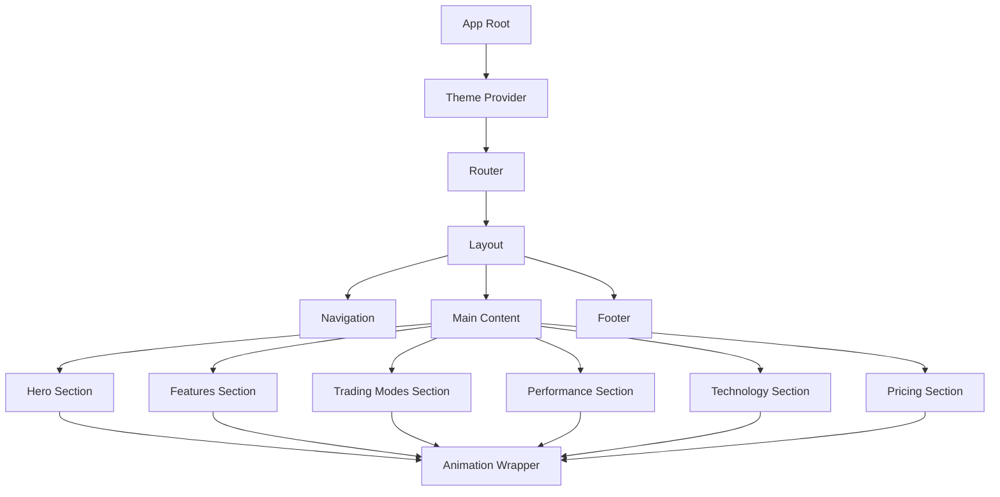

# Design Document: MT5 Gold Trading Bot Website

## Overview

This design document specifies the architecture and implementation approach for a static marketing website for the MT5 Gold Trading Bot. The website will be built as a single-page React application featuring a modern dark theme fintech aesthetic with smooth animations, responsive layouts, and optimized performance.

### Technology Stack

- **Framework**: React 18+ with TypeScript
- **Build Tool**: Vite for fast development and optimized production builds
- **Animation**: Framer Motion for declarative animations
- **Styling**: CSS Modules or Styled Components for component-scoped styles
- **Routing**: React Router v6 for navigation (if multi-page) or smooth scroll for single-page
- **State Management**: React Context API for theme and minimal global state

### Design Philosophy

The website follows a component-driven architecture with emphasis on:
- Performance-first approach with code splitting and lazy loading
- Accessibility compliance (WCAG AA standards)
- Mobile-first responsive design
- Smooth, purposeful animations that enhance UX without hindering performance
- Modular, reusable components with clear separation of concerns

## Architecture

### High-Level Architecture



### Component Hierarchy

The application follows a hierarchical component structure:

1. **App Layer**: Root component with providers (Theme, Router)
2. **Layout Layer**: Persistent UI elements (Navigation, Footer)
3. **Section Layer**: Major content sections (Hero, Features, etc.)
4. **Component Layer**: Reusable UI components (Cards, Buttons, etc.)
5. **Utility Layer**: Hooks, helpers, and animation utilities

### Directory Structure

```
src/
├── components/
│   ├── layout/
│   │   ├── Navigation.tsx
│   │   ├── Footer.tsx
│   │   └── Layout.tsx
│   ├── sections/
│   │   ├── HeroSection.tsx
│   │   ├── FeaturesSection.tsx
│   │   ├── TradingModesSection.tsx
│   │   ├── PerformanceSection.tsx
│   │   ├── TechnologySection.tsx
│   │   └── PricingSection.tsx
│   ├── ui/
│   │   ├── Button.tsx
│   │   ├── Card.tsx
│   │   ├── FeatureCard.tsx
│   │   └── TradingModeCard.tsx
│   └── animations/
│       ├── AnimatedSection.tsx
│       └── AnimatedCard.tsx
├── hooks/
│   ├── useScrollAnimation.ts
│   ├── useMediaQuery.ts
│   └── useIntersectionObserver.ts
├── theme/
│   ├── colors.ts
│   ├── breakpoints.ts
│   └── ThemeProvider.tsx
├── utils/
│   └── animations.ts
├── assets/
│   └── icons/
└── App.tsx
```


## Components and Interfaces

### Core Components

#### 1. Theme Provider

**Purpose**: Centralize theme configuration and provide theme values throughout the app.

**Interface**:
```typescript
interface ThemeColors {
  background: { primary: string; secondary: string; };
  accent: { primary: string; secondary: string; };
  text: { primary: string; secondary: string; };
}

interface Theme {
  colors: ThemeColors;
  breakpoints: Breakpoints;
  spacing: SpacingScale;
  typography: TypographyScale;
}
```

**Implementation Notes**:
- Use React Context to provide theme values
- Export custom hook `useTheme()` for component access
- Define all color constants in a single source of truth

#### 2. Navigation Component

**Purpose**: Provide site navigation with responsive behavior and smooth scrolling.

**Behavior**:
- Desktop: Horizontal navigation bar with links
- Mobile: Hamburger menu with slide-in drawer
- Smooth scroll to sections on click
- Highlight current section based on scroll position
- Fixed/sticky positioning with backdrop blur


#### 3. Hero Section

**Purpose**: Display the main value proposition with headline, subheadline, and CTA.

**Layout**:
- Centered content with max-width container
- Large headline (48-72px on desktop, 32-48px on mobile)
- Subheadline with secondary text color
- Prominent CTA button with primary accent color

**Animations**:
- Headline: Fade in + slide up (delay: 0ms)
- Subheadline: Fade in + slide up (delay: 200ms)
- CTA: Fade in + scale (delay: 400ms)

#### 4. Feature Card Component

**Purpose**: Display individual features in a consistent, visually appealing format.

**Visual Design**:
- Card background: #202020 with subtle border
- Hover state: Slight elevation + border color change to #5DD62C
- Icon container with accent color background
- Title in primary text color
- Description in secondary text color

**Animations**:
- On viewport enter: Fade in + slide up
- Stagger delay: index * 100ms
- Hover: Scale 1.02 + border glow

#### 5. Features Section

**Grid Layout**:
- Mobile: 1 column
- Tablet: 2 columns
- Desktop: 3-4 columns
- Gap: 24px (mobile), 32px (desktop)

**Features to Display**:
1. 40+ Prediction Engines
2. GPU Acceleration (CUDA, DirectML, ROCm)
3. Advanced Risk Management
4. ML Model Integration (LSTM, Random Forest, XGBoost)
5. Multi-Timeframe Analysis (M1 to 1 Month)
6. High-Frequency Execution
7. Real-Time Market Analysis
8. Automated Trade Management


#### 6. Trading Modes Section

**Trading Modes**:
1. **Simple Mode**: Basic automated trading with standard parameters
2. **30+ Pip Guarantee**: Conservative approach with guaranteed minimum profit targets
3. **Profit Maximizer**: Aggressive strategy for maximum returns

**Layout**:
- Desktop: 3 columns (one per mode)
- Tablet: 2 columns (third wraps)
- Mobile: Stacked vertically

#### 7. Performance Visualization Section

**Metrics to Display**:
- Maximum Drawdown Limit
- Profit Target Ranges
- Win Rate Percentage
- Average Trade Duration
- Risk-Reward Ratio

**Visualization Options**:
- Animated counter components for numeric values
- Simple bar charts or progress indicators
- Icon-based metric cards
- Color coding: Green for positive, Red for risk indicators

#### 8. Technology Stack Section

**Categories**:
1. **ML Models**: LSTM, Random Forest, XGBoost, Neural Networks
2. **GPU Acceleration**: CUDA, DirectML, ROCm
3. **Analysis Engines**: 40+ Prediction Engines
4. **Timeframes**: M1, M5, M15, M30, H1, H4, D1, W1, 1 Month
5. **Execution Systems**: High-Frequency Trading, Order Management

**Layout**:
- Grouped by category with visual separators
- Badge or pill-style display for individual technologies
- Grid or flex layout that wraps responsively

#### 9. Button Component

**Variants**:
- **Primary**: #5DD62C background, dark text, used for main CTAs
- **Secondary**: #337418 background, light text, used for secondary actions
- **Outline**: Transparent background, #5DD62C border, used for tertiary actions

**States**:
- Hover: Brightness increase + scale 1.05
- Active: Scale 0.98
- Disabled: Reduced opacity, no interaction


## Data Models

### Theme Configuration

```typescript
const theme: Theme = {
  colors: {
    background: {
      primary: '#0F0F0F',
      secondary: '#202020',
      tertiary: '#2A2A2A',
    },
    accent: {
      primary: '#5DD62C',
      secondary: '#337418',
      hover: '#6FE73D',
    },
    text: {
      primary: '#F8F8F8',
      secondary: '#B8B8B8',
      tertiary: '#808080',
    },
    border: {
      default: '#333333',
      hover: '#5DD62C',
    },
  },
  breakpoints: {
    mobile: '320px',
    tablet: '768px',
    desktop: '1024px',
    wide: '1440px',
  },
  spacing: {
    xs: '4px',
    sm: '8px',
    md: '16px',
    lg: '24px',
    xl: '32px',
    xxl: '48px',
    xxxl: '64px',
  },
  typography: {
    fontFamily: {
      primary: "'Inter', sans-serif",
      mono: "'Fira Code', monospace",
    },
    fontSize: {
      xs: '12px',
      sm: '14px',
      base: '16px',
      lg: '18px',
      xl: '24px',
      xxl: '32px',
      xxxl: '48px',
      display: '72px',
    },
    fontWeight: {
      normal: 400,
      medium: 500,
      semibold: 600,
      bold: 700,
    },
  },
};
```


### Animation System Design

**Framer Motion Configuration**:

```typescript
// Animation variants for sections
const sectionVariants = {
  hidden: { opacity: 0, y: 50 },
  visible: {
    opacity: 1,
    y: 0,
    transition: {
      duration: 0.6,
      ease: 'easeOut',
    },
  },
};

// Animation variants for cards with stagger
const cardVariants = {
  hidden: { opacity: 0, y: 30 },
  visible: (index: number) => ({
    opacity: 1,
    y: 0,
    transition: {
      delay: index * 0.1,
      duration: 0.5,
      ease: 'easeOut',
    },
  }),
};

// Hover animation for interactive elements
const hoverVariants = {
  rest: { scale: 1 },
  hover: {
    scale: 1.05,
    transition: {
      duration: 0.2,
      ease: 'easeInOut',
    },
  },
};
```

**Implementation Strategy**:
- Use `motion` components from Framer Motion for animated elements
- Implement `useInView` hook to trigger animations when elements enter viewport
- Apply staggered animations to lists and grids using `staggerChildren`
- Keep animation durations short (200-600ms) for snappy feel
- Use `will-change` CSS property sparingly to optimize performance


### Responsive Design System

**Breakpoint Strategy**:

```typescript
const breakpoints = {
  mobile: { min: 320, max: 767 },
  tablet: { min: 768, max: 1023 },
  desktop: { min: 1024, max: 1439 },
  wide: { min: 1440 },
};
```

**Layout Patterns**:

1. **Hero Section**:
   - Mobile: Single column, headline 32-40px, padding 16px
   - Tablet: Single column, headline 48px, padding 24px
   - Desktop: Single column centered, headline 64-72px, padding 48px

2. **Feature Grid**:
   - Mobile: 1 column, full width cards
   - Tablet: 2 columns, gap 24px
   - Desktop: 3-4 columns, gap 32px

3. **Trading Modes**:
   - Mobile: Stacked vertically, full width
   - Tablet: 2 columns, third wraps
   - Desktop: 3 columns, equal width

4. **Navigation**:
   - Mobile: Hamburger menu, full-screen overlay
   - Tablet: Horizontal menu, condensed spacing
   - Desktop: Full horizontal menu with spacing

**Typography Scaling**:
- Base font size: 16px
- Mobile scale: 0.875 (14px base)
- Tablet scale: 1.0 (16px base)
- Desktop scale: 1.0 (16px base)
- Headings scale proportionally at each breakpoint


### Routing and Navigation Strategy

**Single-Page Application Approach**:

The website will be implemented as a single-page application with smooth scrolling between sections rather than separate routes. This approach provides:
- Seamless user experience without page reloads
- Smooth scroll animations between sections
- Simpler state management
- Faster perceived performance

**Navigation Implementation**:

```typescript
const sections = [
  { id: 'hero', label: 'Home', href: '#hero' },
  { id: 'features', label: 'Features', href: '#features' },
  { id: 'trading-modes', label: 'Trading Modes', href: '#trading-modes' },
  { id: 'performance', label: 'Performance', href: '#performance' },
  { id: 'technology', label: 'Technology', href: '#technology' },
  { id: 'pricing', label: 'Pricing', href: '#pricing' },
];
```

**Smooth Scroll Behavior**:
- Use `scrollIntoView` with smooth behavior
- Offset scroll position to account for fixed navigation
- Update URL hash without page jump
- Highlight active section in navigation based on scroll position

**Active Section Detection**:
- Use Intersection Observer API to detect which section is in viewport
- Update navigation highlight based on visible section
- Threshold: 50% of section visible to be considered active


### Performance Optimization Strategy

**Code Splitting**:
- Lazy load section components using `React.lazy()` and `Suspense`
- Split animation utilities into separate chunk
- Load icons on demand rather than bundling all upfront

**Asset Optimization**:
- Use WebP format for images with fallbacks
- Implement lazy loading for images below the fold
- Optimize SVG icons by removing unnecessary metadata
- Use CSS sprites for small, frequently used icons

**Bundle Optimization**:
- Tree-shake unused Framer Motion features
- Use production builds of React and dependencies
- Enable Vite's built-in minification and compression
- Target modern browsers to reduce polyfill overhead

**Runtime Performance**:
- Use `React.memo()` for expensive components
- Implement virtual scrolling if content lists grow large
- Debounce scroll event handlers
- Use CSS transforms for animations (GPU-accelerated)
- Avoid layout thrashing by batching DOM reads/writes

**Loading Strategy**:
- Critical CSS inlined in HTML
- Defer non-critical JavaScript
- Preload key fonts
- Use font-display: swap for web fonts

**Target Metrics**:
- First Contentful Paint (FCP): < 1.5s
- Largest Contentful Paint (LCP): < 2.5s
- Time to Interactive (TTI): < 3.5s
- Cumulative Layout Shift (CLS): < 0.1
- Bundle size: < 200KB gzipped (initial load)


## Correctness Properties

A property is a characteristic or behavior that should hold true across all valid executions of a system—essentially, a formal statement about what the system should do. Properties serve as the bridge between human-readable specifications and machine-verifiable correctness guarantees.

### Property Reflection

After analyzing all acceptance criteria, I identified several areas where properties can be consolidated:

**Responsive Layout Properties**: Criteria 8.1, 8.2, and 8.3 all test grid column behavior at different breakpoints. These can be combined into a single comprehensive property about responsive grid adaptation.

**Animation Properties**: Criteria 9.1, 9.3, and 9.5 all relate to animation implementation. These can be consolidated into properties about animation consistency and implementation.

**Theme Color Properties**: Criteria 10.1-10.4 all test specific theme color values. While these are examples, they validate the same underlying property: theme configuration completeness.

**Navigation Properties**: Criteria 12.2, 12.3, and 12.5 all relate to navigation behavior and can be consolidated into comprehensive navigation properties.

### Universal Properties


Property 1: Responsive Grid Adaptation
*For any* section with grid layout, when rendered at mobile width (< 768px), the grid should display 1 column; at tablet width (768-1023px), 2 columns; and at desktop width (≥ 1024px), 3-4 columns.
**Validates: Requirements 2.4, 8.1, 8.2, 8.3**

Property 2: Touch-Friendly Interactive Elements
*For any* interactive element (button, link, card) on mobile devices, the minimum touch target size should be at least 44x44 pixels to ensure accessibility.
**Validates: Requirements 8.5**

Property 3: Font Size Scaling Across Breakpoints
*For any* text element, font sizes should scale appropriately across breakpoints: mobile uses 0.875x base size, while tablet and desktop use 1.0x base size, ensuring readability at all screen sizes.
**Validates: Requirements 8.4**

Property 4: Viewport-Triggered Animations
*For any* animated element, when it enters the viewport (intersection ratio > 0), the Animation_System should trigger the configured entrance animation (fade-in or slide-in).
**Validates: Requirements 9.1**

Property 5: Hover State Visual Feedback
*For any* interactive element, when hovered, the element should provide visual feedback through smooth transitions (scale, color, or opacity changes).
**Validates: Requirements 9.2**

Property 6: Framer Motion Implementation Consistency
*For any* animated component, the animation should be implemented using Framer Motion's motion components or hooks, ensuring consistent animation behavior across the application.
**Validates: Requirements 9.3**

Property 7: Animation Timing Consistency
*For any* animated element, the animation timing and easing functions should use values from the centralized animation configuration (duration: 200-600ms, easing: 'easeOut' or 'easeInOut').
**Validates: Requirements 9.5**

Property 8: Layout Stability During Animations
*For any* animation, the Cumulative Layout Shift (CLS) score should remain below 0.1, ensuring animations do not cause unexpected layout shifts.
**Validates: Requirements 9.4**

Property 9: Color Contrast Accessibility
*For any* text/background color combination in the theme, the contrast ratio should meet or exceed WCAG AA standards (4.5:1 for normal text, 3:1 for large text).
**Validates: Requirements 10.5**

Property 10: Smooth Scroll Navigation
*For any* navigation link click, the page should smoothly scroll to the target section with the configured scroll behavior, and the URL hash should update without causing a page jump.
**Validates: Requirements 12.2**

Property 11: Navigation Accessibility Across Breakpoints
*For any* screen size, the navigation menu should be present and accessible: horizontal menu on desktop/tablet, hamburger menu on mobile.
**Validates: Requirements 12.3**

Property 12: Active Section Highlighting
*For any* section currently in the viewport (intersection ratio > 0.5), the corresponding navigation item should be highlighted with an active state.
**Validates: Requirements 12.5**


## Error Handling

### Component Error Boundaries

**Strategy**: Implement React Error Boundaries to catch and handle component errors gracefully.

```typescript
class ErrorBoundary extends React.Component {
  state = { hasError: false, error: null };
  
  static getDerivedStateFromError(error) {
    return { hasError: true, error };
  }
  
  componentDidCatch(error, errorInfo) {
    console.error('Component error:', error, errorInfo);
  }
  
  render() {
    if (this.state.hasError) {
      return <ErrorFallback error={this.state.error} />;
    }
    return this.props.children;
  }
}
```

**Error Boundary Placement**:
- Wrap each major section component
- Wrap the entire app for catastrophic failures
- Provide user-friendly error messages

### Animation Error Handling

**Fallback Strategy**:
- If Framer Motion fails to load, provide CSS-only fallback animations
- Gracefully degrade to static content if animations cause performance issues
- Use `prefers-reduced-motion` media query to respect user preferences

```typescript
const shouldAnimate = !window.matchMedia('(prefers-reduced-motion: reduce)').matches;
```

### Asset Loading Errors

**Image Loading**:
- Provide fallback images or placeholders for failed image loads
- Use `onError` handlers to replace broken images
- Implement lazy loading with loading states

**Font Loading**:
- Use `font-display: swap` to prevent invisible text
- Provide system font fallbacks
- Handle font loading failures gracefully

### Navigation Errors

**Scroll Errors**:
- Catch errors in smooth scroll implementation
- Fall back to instant scroll if smooth scroll fails
- Validate section IDs before attempting to scroll

**Intersection Observer Errors**:
- Check for Intersection Observer API support
- Provide fallback for unsupported browsers
- Gracefully handle observer initialization failures


## Testing Strategy

### Dual Testing Approach

The testing strategy employs both unit tests and property-based tests to ensure comprehensive coverage:

- **Unit tests**: Verify specific examples, edge cases, and error conditions
- **Property tests**: Verify universal properties across all inputs

Both approaches are complementary and necessary. Unit tests catch concrete bugs in specific scenarios, while property tests verify general correctness across a wide range of inputs.

### Unit Testing

**Framework**: Vitest + React Testing Library

**Unit Test Focus Areas**:
1. **Component Rendering**: Verify specific components render with expected content
2. **User Interactions**: Test click handlers, form submissions, navigation
3. **Edge Cases**: Empty states, missing data, error conditions
4. **Integration Points**: Component composition, context providers, hooks

**Example Unit Tests**:
- Hero section renders with headline and CTA button
- Feature cards display correct icons and descriptions
- Navigation menu toggles on mobile
- Theme provider supplies correct color values
- Button variants render with correct styles

**Unit Test Balance**:
- Focus on specific examples and edge cases
- Avoid writing too many unit tests for scenarios covered by property tests
- Prioritize integration points and user-facing functionality

### Property-Based Testing

**Framework**: fast-check (JavaScript property-based testing library)

**Configuration**:
- Minimum 100 iterations per property test
- Each test tagged with feature name and property number
- Tag format: `Feature: mt5-gold-trading-bot-website, Property {N}: {property_text}`

**Property Test Focus Areas**:
1. **Responsive Behavior**: Grid layouts adapt correctly across all viewport widths
2. **Animation Consistency**: All animations use consistent timing and implementation
3. **Accessibility**: Color contrast ratios meet standards for all combinations
4. **Navigation**: Smooth scroll and active highlighting work for all sections
5. **Touch Targets**: Interactive elements meet size requirements across devices

**Property Test Implementation**:

Each correctness property from the design document must be implemented as a single property-based test:

- Property 1: Generate random viewport widths, verify grid column counts
- Property 2: Generate random interactive elements, verify minimum touch target sizes
- Property 3: Generate random text elements, verify font scaling at each breakpoint
- Property 4: Generate random animated elements, verify viewport-triggered animations
- Property 5: Generate random interactive elements, verify hover state feedback
- Property 6: Verify all animated components use Framer Motion
- Property 7: Generate random animations, verify timing consistency
- Property 8: Measure CLS during animations, verify < 0.1
- Property 9: Generate random color combinations, verify contrast ratios
- Property 10: Generate random navigation clicks, verify smooth scroll behavior
- Property 11: Generate random viewport sizes, verify navigation accessibility
- Property 12: Generate random scroll positions, verify active section highlighting


### Testing Tools and Setup

**Testing Stack**:
```json
{
  "vitest": "^1.0.0",
  "@testing-library/react": "^14.0.0",
  "@testing-library/jest-dom": "^6.0.0",
  "@testing-library/user-event": "^14.0.0",
  "fast-check": "^3.0.0",
  "axe-core": "^4.0.0"
}
```

**Test Configuration** (vitest.config.ts):
```typescript
export default defineConfig({
  test: {
    globals: true,
    environment: 'jsdom',
    setupFiles: './src/test/setup.ts',
    coverage: {
      provider: 'v8',
      reporter: ['text', 'json', 'html'],
      exclude: ['node_modules/', 'src/test/'],
    },
  },
});
```

**Accessibility Testing**:
- Use axe-core for automated accessibility testing
- Test color contrast ratios programmatically
- Verify ARIA attributes and semantic HTML
- Test keyboard navigation

**Visual Regression Testing** (Optional):
- Use Playwright or Chromatic for visual regression tests
- Capture screenshots at different breakpoints
- Compare against baseline images
- Detect unintended visual changes

### Test Organization

```
src/
├── components/
│   ├── Button.tsx
│   ├── Button.test.tsx
│   ├── Button.properties.test.tsx
│   └── ...
├── test/
│   ├── setup.ts
│   ├── helpers/
│   │   ├── renderWithTheme.tsx
│   │   └── generators.ts
│   └── properties/
│       ├── responsive.properties.test.ts
│       ├── animation.properties.test.ts
│       └── accessibility.properties.test.ts
```

**Naming Conventions**:
- Unit tests: `ComponentName.test.tsx`
- Property tests: `ComponentName.properties.test.tsx` or grouped in `test/properties/`
- Test helpers: `test/helpers/`

### Continuous Integration

**CI Pipeline**:
1. Run linter (ESLint)
2. Run type checker (TypeScript)
3. Run unit tests
4. Run property tests (100+ iterations)
5. Generate coverage report
6. Build production bundle
7. Run accessibility tests

**Coverage Targets**:
- Line coverage: > 80%
- Branch coverage: > 75%
- Function coverage: > 80%
- Property test coverage: 100% of defined properties

